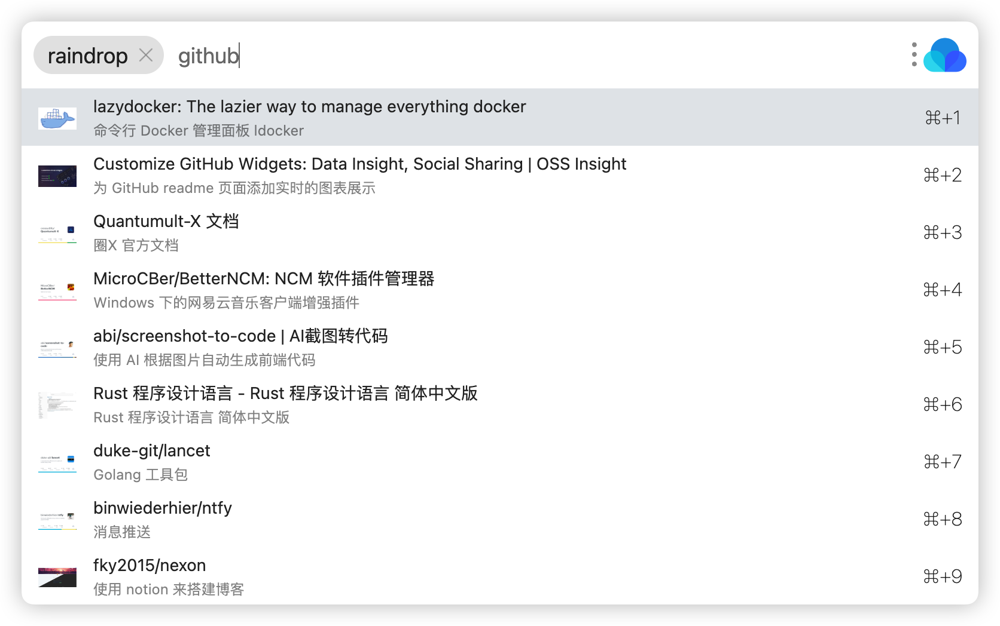
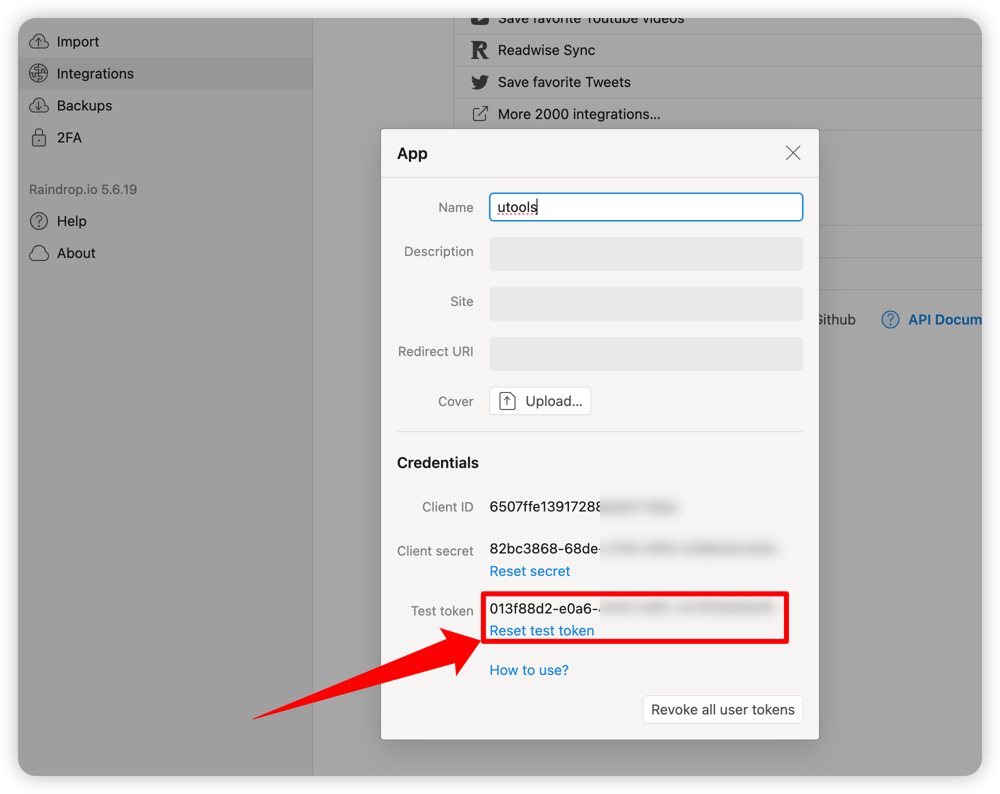
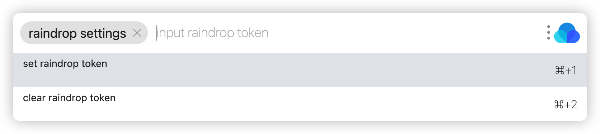

# uTools Raindrop
Raindrop 书签 uTools 插件.

Features:
- 本地搜索优先，极速响应
- 优化结果排序，最近使用过的优先

# 使用

## 1. 获取 Raindrop Token
- 登录 https://raindrop.io/
- 进入 Settings -> Integrations -> For Developers
- 创建一个新的APP：Create new app
- 得到 Test token

## 2. 设置 Raindrop Token

Have fun!

Github: https://github.com/jae-jae/utools-raindrop